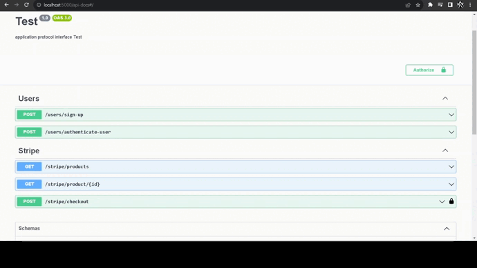
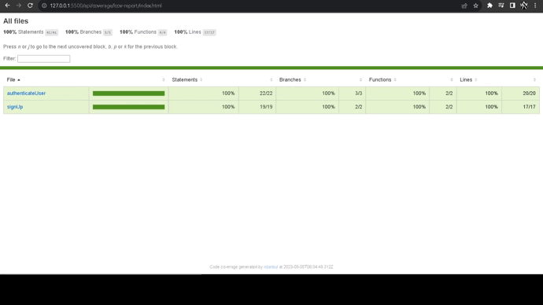

# Technical Test

## :dart: Objetivo

### Api desenvolvida para teste técnico de vaga para desenvolvedor fullstack. Principais características:

- [x] Aplicação de conceitos da arquitetura limpa
- [x] Desacoplamento de camadas application e infra
- [x] Aplicação do pattern de repositórios em memória, dessa forma a aplicação não necessita de um banco de dados para funcionar
- [x] Aplicação dos conceitos S.O.L.I.D
- [x] Aplicação de Patterns, principalmente Adpater na camada de Providers e Data Mapper na geração de novas instancias das entidades
- [x] Integração com o getaway de pagamento Stripe

## :memo: Documentação

Documentação feita com Swagger. Mapeamento de dados de entrada e saída com exemplos.

<div align="center">
	
</div>

## :rocket: Testes

Testes realizados com Jest, mapeando todos os casos de uso da camada application da aplicação.

<div align="center">
	
</div>

## :hammer_and_wrench: Ferramentas

- [@nestjs/jwt](https://www.npmjs.com/package/@nestjs/jwt)
- [@nestjs/passport](https://www.npmjs.com/package/@nestjs/passport)
- [@nestjs/swagger](https://www.npmjs.com/package/@nestjs/swagger)
- [@nestjs/typeorm](https://www.npmjs.com/package/@nestjs/typeorm)
- [bcryptjs](https://www.npmjs.com/package/bcryptjs)
- [class-transformer](https://www.npmjs.com/package/class-transformer)
- [class-validator](https://www.npmjs.com/package/class-validator)
- [dotenv](https://www.npmjs.com/package/dotenv)
- [jsonwebtoken](https://www.npmjs.com/package/jsonwebtoken)
- [passport](https://www.npmjs.com/package/passport)
- [passport-jwt](https://www.npmjs.com/package/passport-jwt)
- [signale](https://www.npmjs.com/package/signale)
- [stripe](https://stripe.com/docs)
- [typeorm](https://www.npmjs.com/package/typeorm)
- [uuid](https://www.npmjs.com/package/uuid)

## :desktop_computer: Padronização de código

- [Eslint](https://eslint.org/)
- [Prettier](https://prettier.io/)

## :rocket: Executando o projeto

```bash
// Instale as dependências

npm i

// Rodar testes

npm run test ou npm run test:cov

// Documentação

http://localhost:5000/api-docs

// Executando aplicação
// Obs: As migrações necessárias serão executadas durante a inicialização da aplicação

docker compose up
```
