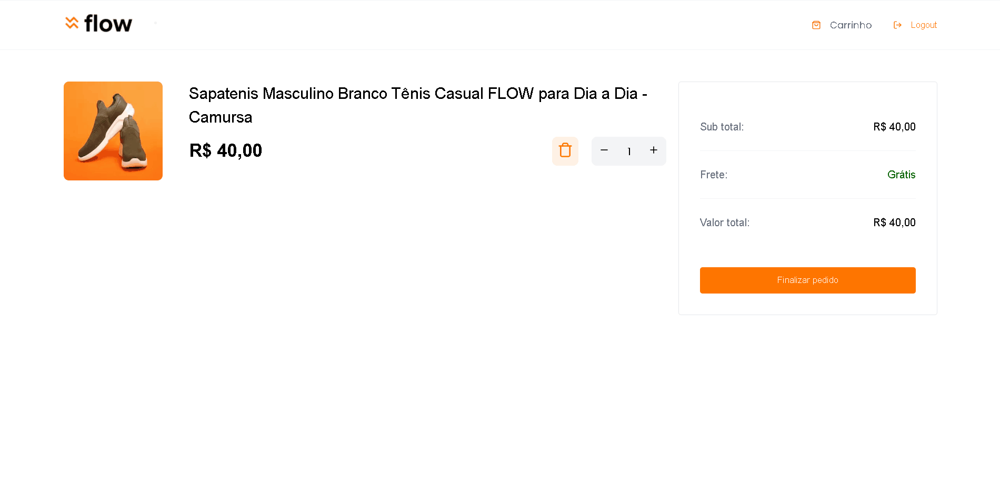

# Technical Test

## :dart: Objetivo

### Aplicação web desenvolvida para teste técnico de vaga para desenvolvedor fullstack. Principais características:

- [x] Uso do Styled-Components com novas propriedades e configurações do Next 13
- [x] Uso da feature de componentes assíncronos do Next 13
- [x] Integração com o Stripe para realização de pagamentos
- [x] Uso de contextos, dtos, hooks personalizados e componentização
- [x] Validação de formulários com react-hook
- [x] Pequenos ajustes no design para se encaixar ao uso do Stripe
- [x] Projeto no ponto de ser usado como protótipo

## :rocket: Exemplo de funcionalidade do Stripe

<div align="center">
	
</div>

## :hammer_and_wrench: Ferramentas

- [@radix-ui/react-dialog](https://www.npmjs.com/package/@radix-ui/react-dialog)
- [axios](https://www.npmjs.com/package/axios)
- [immer](https://www.npmjs.com/package/immer)
- [js-cookie](https://www.npmjs.com/package/js-cookie)
- [lucide-react](https://www.npmjs.com/package/lucide-react)
- [react-hook-form](https://www.npmjs.com/package/react-hook-form)
- [styled-components](https://www.npmjs.com/package/styled-components)
- [zod](https://www.npmjs.com/package/zod)

## :desktop_computer: Padronização de código

- [Eslint](https://eslint.org/)
- [Prettier](https://prettier.io/)

## :rocket: Executando o projeto

```bash
// Instale as dependências

npm i

// Executando aplicação

npm run dev
```
